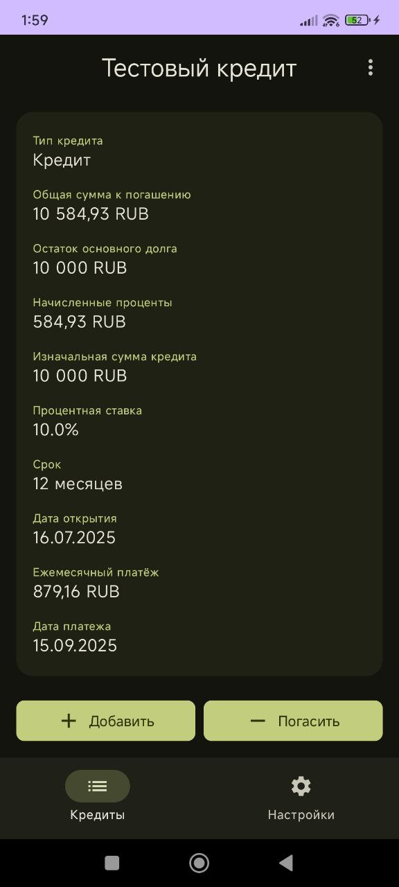
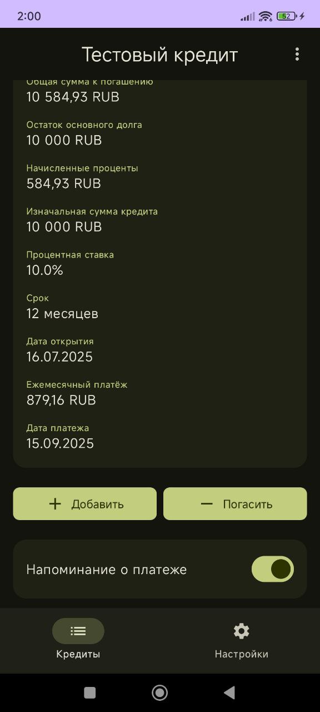

# Кредитник

**Кредитник** — это простое и удобное Android-приложение для учёта долгов и кредитов. Оно помогает пользователям отслеживать свои финансовые обязательства, автоматически рассчитывает проценты и заблаговременно напоминает о предстоящих платежах.

## 📱 Скриншоты

#### Главный экран со списком кредитов
<div align="center">
  <a href="./screenshots/CreditsScreen.jpg">
    
  </a>
</div>

#### Экран деталей кредита (верхняя и нижняя части)
<div align="center">
  <a href="./screenshots/LoanDetailScreen.jpg">
    
  </a>
</div>
<div align="center">
  <a href="./screenshots/LoanDetailScreen2.jpg">
    
  </a>
</div>

#### Экран добавления нового кредита
<div align="center">
  <a href="./screenshots/AddLoanScreen.jpg">
    
  </a>
</div>

#### Экран настроек (в светлой и тёмной теме)
<div align="center">
  <a href="./screenshots/SettingsScreen.jpg">
    
  </a>
</div>
<div align="center">
  <a href="./screenshots/SettingsScreen2.jpg">
    
  </a>
</div>

## ✨ Основные возможности

* **Учёт кредитов и долгов:** Добавление, редактирование и удаление записей о финансовых обязательствах.
* **Автоматический расчёт срока:** Приложение само вычисляет предполагаемый срок погашения кредита на основе суммы, ставки и ежемесячного платежа.
* **Гибкий расчёт процентов:** Ежедневное начисление процентов на остаток основного долга с возможностью включить специальный режим расчёта «как в Сбере», чтобы точнее совпадать с выписками крупных банков.
* **Умная система погашения:** При внесении платежа сумма сначала идёт на погашение начисленных процентов, и только потом — на уменьшение основного долга (тела кредита).
* **Настраиваемые напоминания:** Установка уведомлений о предстоящих платежах с выбором времени и количества дней.
* **Персонализация:**
  * Поддержка светлой и тёмной тем оформления.
  * Выбор валюты по умолчанию для отображения сумм.
* **Интуитивно понятный интерфейс:** Чистый и современный дизайн, построенный на Jetpack Compose.
* **Мульти-удаление:** Возможность выбрать несколько кредитов на главном экране для их одновременного удаления.

## 🛠️ Технологический стек и архитектура

Проект построен на современных технологиях, рекомендованных Google для разработки под Android.

* **Язык:** [Kotlin](https://kotlinlang.org/)
* **Архитектура:** **MVVM (Model-View-ViewModel)**, которая разделяет логику представления данных от UI.
  * **ViewModel:** `LoanViewModel`, `SettingsViewModel` для управления состоянием экранов.
  * **Repository:** `LoanRepository` как единый источник данных, работающий с базой данных.
  * **Model:** `Loan` (сущность Room).
* **UI:** **Jetpack Compose** — современный декларативный UI-фреймворк для создания нативных интерфейсов.
* **Асинхронность:** **Kotlin Coroutines** и **Flow** для управления фоновыми задачами и реактивного обновления UI.
* **База данных:** **Room** — библиотека для локального хранения данных в SQLite.
* **Навигация:** **Jetpack Navigation for Compose** для перемещения между экранами.
* **Хранение настроек:** **Jetpack DataStore** для сохранения простых данных, таких как настройки темы и валюты.
* **Уведомления:** **`AlarmManager`** для точного планирования уведомлений и **`NotificationManager`** для их отображения.

## 🧠 Ключевые моменты логики

Особое внимание в проекте уделено корректному финансовому учёту.

### 1. Ежедневное начисление процентов

Функция `calculateAndAccrueInterestAndSave` в `LoanViewModel` отвечает за актуализацию состояния кредита. Она вызывается при каждом запуске приложения и перед любой финансовой операцией.

* **Логика:**
  1.  Определяется количество дней, прошедших с последнего расчёта, с помощью надёжного метода `ChronoUnit.DAYS.between`, который корректно обрабатывает високосные годы и переходы через месяцы.
  2.  Рассчитывается сумма процентов за этот период по формуле: `Остаток_тела_кредита * (Ставка / 100 / 365) * Количество_дней`.
  3.  Начисленные проценты добавляются к полю `accruedInterest`.
  4.  Дата последнего расчёта обновляется на текущую.
* **Гибкость:** Приложение включает опцию «Расчёт по методу Сбера». Если она активна, проценты начисляются по предыдущий день (`сегодня - 1 день`), что позволяет добиться максимального совпадения с банковскими выписками, которые часто обновляются с задержкой.
* **Надёжность:** Функция также обрабатывает случай, когда системное время было переведено назад, и корректно отменяет излишне начисленные проценты.

### 2. Обработка платежей и пополнений

Функция `updateLoanPrincipal` в `LoanViewModel` управляет изменением баланса кредита.

* **Логика при погашении (платёж):**
  1.  Сначала сумма платежа направляется на погашение накопленных процентов (`accruedInterest`).
  2.  Если после погашения процентов остаются средства, они идут на уменьшение основного долга (`principal`).
* **Логика при пополнении (увеличение долга):**
  1.  Сумма напрямую добавляется к основному долгу (`principal`).

Такой подход обеспечивает стандартную для банковской системы очерёдность погашения задолженности.

## 🚀 Сборка и запуск

1.  Клонируйте репозиторий:
    ```bash
    git clone [https://github.com/Ric377/kreditnik.git](https://github.com/Ric377/kreditnik.git)
    ```
2.  Откройте проект в [Android Studio](https://developer.android.com/studio).
3.  Запустите сборку проекта (Build -> Make Project).
4.  Запустите приложение на эмуляторе или физическом устройстве.

## 💡 Возможные улучшения

* **Визуализация:** Добавить графики и диаграммы для отслеживания прогресса погашения кредита.
* **Резервное копирование:** Добавить функцию импорта/экспорта данных в файл или облако.
* **Тесты:** Написать Unit-тесты для `LoanViewModel` для проверки корректности финансовых расчётов.